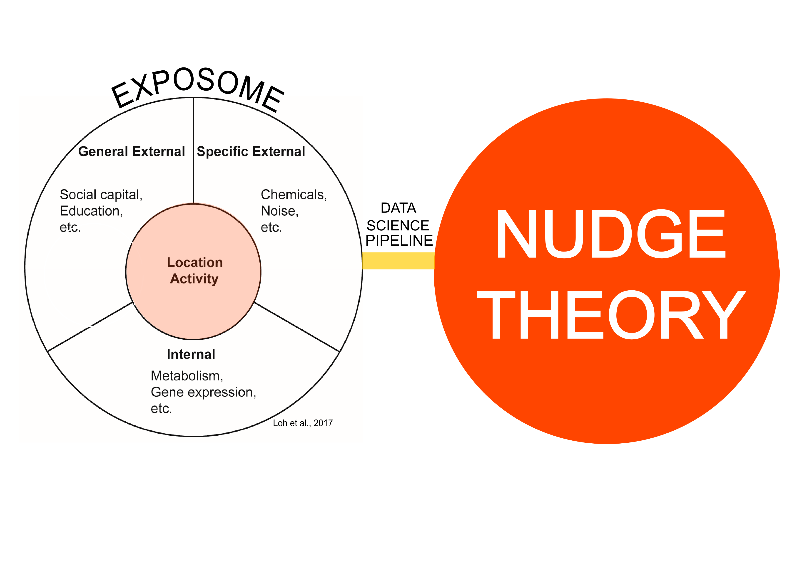

Simple Features in R
========================================================
author: Mark Cherrie
date: 28/05/18
autosize: false
font-import: http://fonts.googleapis.com/css?family=Open+Sans
font-family: 'Open Sans', sans-serif;

</img>

<style>
.small-code pre code {
  font-size: 1em;
}
</style>


Geospatial Analysis in R
========================================================

</img>


What are Simple Features?
========================================================

- Simple feature access is an ISO standard that is widely adopted. It is used in spatial databases (PostGIS), GIS (ArcGIS), open source libraries, GeoJSON, GeoSPARQL, etc.
  - Fast reading and writing of data
  - Enhanced plotting performance
  - sf objects can be treated as data frames in most operations
  - sf functions can be combined using %>% operator and works well with the tidyverse collection of R packages
  - sf function names are relatively consistent and intuitive (all begin with st_)

Exposome and Nudge Theory
========================================================

</img>

Exposome and Nudge Theory
========================================================

</img>


Data Science Pipeline
========================================================

- Process location data
- Process environment data
- Calculate measure of semantic naturalness
- Share data visualisations


Setup 
========================================================

-  Install external packages

```r
library(devtools)
#install_github("r-spatial/sf")
#install.packages("RoogleVision", repos = c(getOption("repos"), "http://cloudyr.github.io/drat"))
```

- Install CRAN packages


```r
#install.packages(c("tidyverse",
# "data.table", "pbapply","XML", 
# "dtplyr", "mapview","sp", "googleway",
# "adehabitatHR", "zoo", "argosfilter"))
```

Setup
========================================================

- Load packages and external functions

```r
# load the packages
invisible(lapply(c(
         "sf","tidyverse","data.table",
         "pbapply","XML", "dtplyr", 
         "mapview","sp", "googleway", 
         "RoogleVision", "adehabitatHR", 
         "zoo", "argosfilter"), 
         require, character.only = TRUE))

# Install User Written Functions
for (i in c("functions")){
  source(paste0(i, ".R"), echo=FALSE)
}
```

Break
========================================================

- 5 mins


Google Maps API
========================================================

- There is lots of information available in Google ecosystem:
  - Places API
  - Directions API
  - Street View API
  - Vision API

- Get an API key: https://developers.google.com/maps/documentation/javascript/get-api-key
- Note that starting July 16, 2018, a new pay-as-you-go pricing plan will go into effect for Maps, Routes, and Places ($200 free a month; e.g. 40,000 directions calls)

Google Maps Data
========================================================


```
Error in fun_download_data(map_url, simplify, curl_proxy) : 
  Can not retrieve results. No valid internet connection (tested using curl::has_internet() )
```
